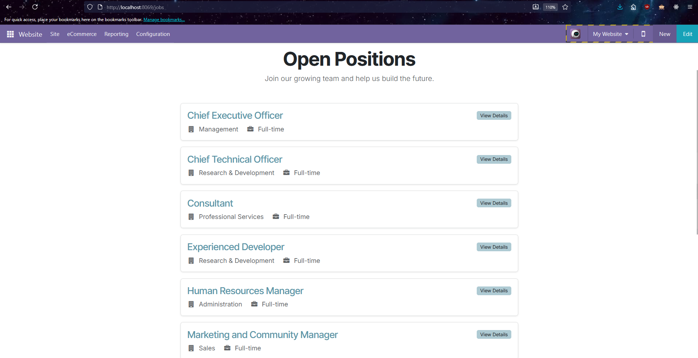
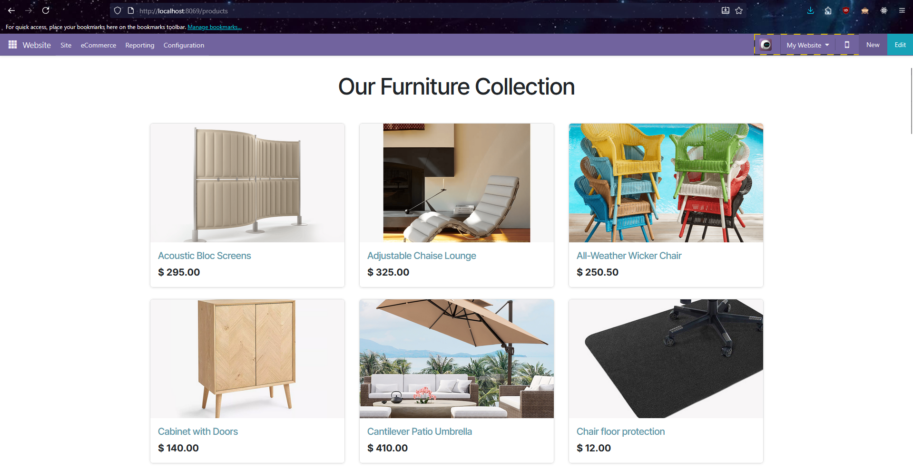

# HR & Recruitment Portal for Odoo 18 (om_hr_portal)

<div align="center">
  
</div>

## Overview

Welcome to the HR & Recruitment Portal module, a comprehensive enhancement for Odoo 18 Community Edition. This project was developed as part of a software engineering internship program, designed to transform a standard Odoo instance into a complete corporate website and HR management platform for **"Atelier Forma"**, a fictional high-end furniture design company.

The module seamlessly integrates a beautifully designed public-facing website with powerful backend functionalities, providing a robust solution for talent acquisition and corporate presence.

## Features

### 1. Enhanced Public Website (Frontend)

- **Stunning Landing Page:** A modern, visually appealing landing page designed to impress visitors and tell the company's story.
- **Corporate Pages:**
  - **About Us:** A detailed page showcasing the company's journey, values, and mission.
  - **Design Process:** An inside look into the craftsmanship and passion behind the products.
  - **Services & Design Services:** Professional pages outlining the company's offerings, with a dedicated landing page for high-value design services.
- **eCommerce Integration ("Shop"):**
  - **Products Page:** Displays the company's furniture collections with sample data.
- **Legal & Informational Pages:**
  - **FAQ, Shipping, Returns, Terms & Conditions:** Professionally designed pages that build customer trust and clarity.
- **Advanced Recruitment Portal ("Jobs"):**
  - A redesigned, card-based layout for job listings.
  - A user-friendly application form for candidates to submit their information and CVs directly.

### 2. HR & Employee Management (Backend)

- **Custom Employee Fields:** The `hr.employee` model is extended with additional fields relevant to local business practices (e.g., Citizen ID, Bank Account Number).
- **Custom Job Fields:** The `hr.job` model is extended to include "Job Type" (Full-time, Contract, etc.) for better filtering and display.
- **Automated Workflows:** The system automatically creates `hr.candidate` and `hr.applicant` records from website form submissions.

## Live Demo (Screenshots)

*(A few key screenshots to showcase the project's quality)*

**Landing Page:**

<div align="left">
  
</div>

**Jobs Page:**

<div align="left">
  
</div>

**Products Page:**

<div align="left">
  
</div>


## Technical Stack

- **Framework:** Odoo Community Version 18
- **Language:** Python 3.12+
- **Database:** PostgreSQL 16+
- **Frontend:** Odoo's native QWeb templating engine, XML, HTML5, Bootstrap 5, CSS3, JavaScript.

---

## Installation & Setup

This guide provides comprehensive instructions for setting up the project from scratch, including the Odoo environment itself.

### Part 1: Setting Up the Odoo 18 Environment

If you do not have an Odoo 18 development environment, follow these steps first.

#### **Prerequisites:**

1.  **Git:** [Download and install Git](https://git-scm.com/downloads/win) for Windows.
2.  **Python 3.12.x:**
    - Go to the [official Python website](https://www.python.org/downloads/).
    - Download and run the installer for a specific Python 3.12 version (e.g., 3.12.10).
    - **CRITICAL:** During installation, check the box that says **"Add Python to PATH"**.
3.  **PostgreSQL 16.x:**
    - Download the installer from the [PostgreSQL website (via EDB)](https://www.enterprisedb.com/downloads/postgres-postgresql-downloads).
    - Run the installer. You will be asked to set a password for the `postgres` superuser. **Remember this password** (we will use `admin` in this guide).
4.  **Visual C++ Build Tools:**
    - Download ["Build Tools for Visual Studio"](https://visualstudio.microsoft.com/visual-cpp-build-tools/).
    - During installation, select the **"Desktop development with C++"** workload. This is required for compiling some Python dependencies.
5.  **(Optional but Recommended) A code editor:** [Visual Studio Code](https://code.visualstudio.com/) is an excellent choice.

#### **Installation Steps:**

1.  **Clone the Odoo Source Code:**
    Open a command prompt (cmd) or PowerShell and navigate to your desired development folder (e.g., `D:\odoo-dev`). Then, clone the Odoo 18 repository:
    ```bash
    git clone https://www.github.com/odoo/odoo.git -b 18.0 --depth=1
    ```

2.  **Create a Python Virtual Environment:**
    Navigate into the cloned directory and create a virtual environment. This keeps project dependencies isolated.
    ```bash
    cd odoo
    python -m venv venv
    ```

3.  **Activate the Virtual Environment:**
    ```bash
    .\venv\Scripts\activate
    ```
    You should see `(venv)` appear at the beginning of your command line.

4.  **Install Python Dependencies:**
    While the virtual environment is active, install all of Odoo's required packages.
    ```bash
    pip install -r requirements.txt
    ```

5.  **Create a Configuration File:**
    In the `D:\odoo-dev\odoo` directory, create a new file named `odoo.conf`. Paste the following content into it, making sure to **adjust the paths to match your system**.

    ```ini
    [options]
    admin_passwd = your_super_secret_admin_password
    db_host = localhost
    db_port = 5432
    db_user = postgres
    db_password = admin  ; The password you set for PostgreSQL
    
    ; *** IMPORTANT: Update these paths ***
    addons_path = D:\\odoo-dev\\odoo\\addons,D:\\odoo-dev\\odoo\\custom_addons
    ```

6.  **Create Custom Addons Folder:**
    Create a `custom_addons` folder inside your `odoo` folder (e.g., at `D:\odoo-dev\odoo\custom_addons`). This is where you will place the `om_hr_portal` module.

### Part 2: Installing the `om_hr_portal` Module

1.  **Download the Module:**
    - Clone this repository or download it as a ZIP file.
    - Place the entire `om_hr_portal` folder inside your `custom_addons` directory (`D:\odoo-dev\odoo\custom_addons`).

2.  **Run Odoo Server:**
    - Make sure your virtual environment is active.
    - Navigate to your Odoo directory (`D:\odoo-dev\odoo`).
    - Start the Odoo server with your configuration file:
      ```bash
      python odoo-bin -c odoo.conf
      ```

3.  **Create a New Odoo Database:**
    - Open your web browser and navigate to `http://localhost:8069`.
    - You will see the Odoo database creation page. Fill in the required details: set a master password, choose a database name (e.g., `hr_portal_db`), provide your email/password, and ensure **"Load demonstration data" is checked** to have sample data for modules like HR and eCommerce.

4.  **Install the Module:**
    - After logging into your new database, go to the **Apps** menu.
    - In the top bar, click **"Update Apps List"** and confirm.
    - Remove the default "Apps" filter from the search bar.
    - Search for `HR & Recruitment Portal`.
    - Click the **"Activate"** button on the module card.

    The system will install the module and all its dependencies (`Website`, `eCommerce`, `Recruitment`, etc.). Once done, your Atelier Forma website and HR portal will be fully operational!

---

## Author

- **Name:** Duong Hoang Lan Anh
- **Contact:** dhlananh2309@gmail.com
- **GitHub:** https://github.com/dhlananhh/
